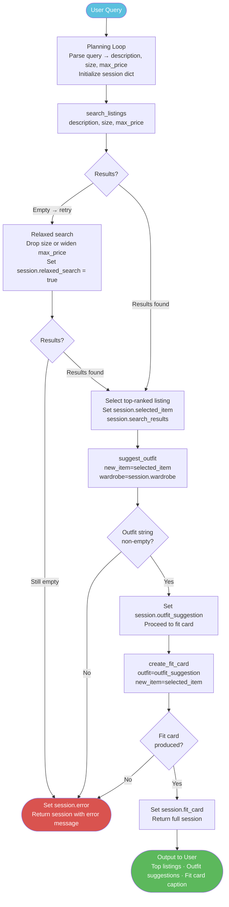

# FitFindr — planning.md

> Complete this document before writing any implementation code.
> Your spec and agent diagram are what you'll use to direct AI tools (Claude, Copilot, etc.) to generate your implementation — the more specific they are, the more useful the generated code will be.
> Your planning.md will be reviewed as part of your submission.
> Update it before starting any stretch features.

---

## Tools

List every tool your agent will use. For each tool, fill in all four fields.
You must have at least 3 tools. The three required tools are listed — add any additional tools below them.

### Tool 1: search_listings

**What it does:**
<!-- Describe what this tool does in 1–2 sentences -->
Search the local listings.json dataset for thrifted items matching a keyword description, optional size, and optional max_price. Scores and returns matching listing dicts sorted by relevance (best first).

**Input parameters:**
<!-- List each parameter, its type, and what it represents -->
- `description` (str): User keywords describing the desired item (e.g., "vintage graphic tee", "90s track jacket"). The agent will parse out price/size and pass only the descriptive keywords here.
- `size` (str): Optional size filter (e.g., "M", "W30", "US 8"). Matching is case-insensitive and supports substring matches (e.g., "M" matches "S/M"). If None, size filtering is skipped.
- `max_price` (float): Optional inclusive price ceiling (e.g., 30.0). If None, price filtering is skipped.

**What it returns:**
<!-- Describe the return value — what fields does a result contain? -->
A list of listing dictionaries (same format as entries in data/listings.json). Each listing contains: id, title, description, category, style_tags (list), size, condition, price (float), colors (list), brand, platform.

Results are sorted by a computed relevance score (highest first). Return an empty list if nothing matches instead of raising exceptions.

**What happens if it fails or returns nothing:**
<!-- What should the agent do if no listings match? -->
If data loading fails, the function should return an empty list and log or surface a clear error message; the agent (agent.py) will return early with a helpful message to the user.

Optionally, the agent can offer fallback behavior (in planning.md/agent): if no results, call search_listings() again with relaxed filters (e.g., remove size or increase max_price) or ask the user to broaden their query. If relaxed filters were used, the agent should let the user know.

Scoring implementation notes:

1.Load listings with load_listings() from utils/data_loader.py.

2. Apply filters if provided: drop listings where price > max_price, keep listings where listing size.lower() contains user size.lower() (substring match).

3. Compute a relevance score for each remaining listing: split text into discrete searchable words (tokens). make lowercase, strip most punctuation, and keep meaningful pieces (words, numbers, size labels like S/M). Tokens are what you match against listing fields For every token match, add 1 to the relevance score

4. Sort by score (descending). For ties, prefer lower price.

5. Return all matches.

---

### Tool 2: suggest_outfit

**What it does:**
<!-- Describe what this tool does in 1–2 sentences -->
Given a thrift listing and a user's wardrobe, produce 1–2 concrete outfit suggestions that use the new item plus named pieces from the wardrobe; if the wardrobe is empty, return general styling guidance and mood/vibe suggestions for the new item.

**Input parameters:**
<!-- List each parameter, its type, and what it represents -->
- `new_item` (dict): A listing dict (fields: id, title, description, category, style_tags, size, condition, price, colors, brand, platform).
- `wardrobe` (dict): A wardrobe dict with an items key (list of item dicts per data/wardrobe_schema.json). May be empty.

**What it returns:**
<!-- Describe the return value -->
A non-empty string with 1–2 concrete outfit suggestions (each 1–3 short sentences) that reference the new_item and name specific wardrobe pieces when available; if the wardrobe is empty, return 3–5 concise general styling tips (pairings, vibe, and suggested occasions) suitable for feeding into create_fit_card() .

**What happens if it fails or returns nothing:**
<!-- What should the agent do if the wardrobe is empty or no outfit can be suggested? -->
always return a user-facing string instead of raising exceptions. If the wardrobe is missing or malformed, return a graceful fallback: a short set of styling tips derived from the new_item's category, colors, and style_tags and a note that suggestions are generic.

---

### Tool 3: create_fit_card

**What it does:**
<!-- Describe what this tool does in 1–2 sentences -->
Generate a short, shareable 2–4 sentence caption (fit card) for a thrifted find that mentions the item, price, and platform naturally.

**Input parameters:**
<!-- List each parameter, its type, and what it represents -->
- `outfit` (str): The outfit suggestion text from suggest_outfit(); may be 1–2 outfit options.
- `new_item` (dict): The listing dict for the thrifted item (fields: id, title, description, category, style_tags, size, condition, price, colors, brand, platform).

**What it returns:**
<!-- Describe the return value -->
A 2–4 sentence human-readable caption string suitable for social sharing that mentions the item title, price, and platform once, captures the outfit vibe, and reads casually/authentically.

**What happens if it fails or returns nothing:**
<!-- What should the agent do if the outfit data is incomplete? -->
return a user-facing error string instead of raising exceptions. If outfit is empty or missing, return a descriptive message like "Could not generate fit card: missing outfit details." If the LLM call fails, return a brief fallback caption derived from new_item metadata and note that it is a generic suggestion.

---

### Additional Tools (if any)

<!-- Copy the block above for any tools beyond the required three -->

---

## Planning Loop

**How does your agent decide which tool to call next?**
<!-- Describe the logic your planning loop uses. What does it look at? What conditions change its behavior? How does it know when it's done? -->
The planning loop starts by parsing the user's free-text query into structured parameters (description, optional size, optional max_price) and storing them in the session; it then calls search_listings with those parameters and writes the returned list to session["search_results"]. If no listings are returned the loop either attempts a single relaxed search (e.g., drop size or widen max_price) or sets session["error"] with a friendly message and stops; otherwise it selects the top-ranked listing into session["selected_item"] and passes that plus the user's wardrobe into suggest_outfit, saving the returned text to session["outfit_suggestion"]. With a non-empty outfit suggestion the loop then calls create_fit_card(outfit, selected_item) and stores the resulting caption in session["fit_card"]; any malformed inputs, LLM failures, or missing required outputs are handled by setting session["error"] rather than raising exceptions. The loop finishes when either session["fit_card"] is produced (success) or session["error"] is set (early termination), and it always returns the full session dict so the caller can display results and any diagnostic notes (for example, whether a relaxed search was used).

---

## State Management

**How does information from one tool get passed to the next?**
<!-- Describe how your agent stores and accesses state within a session. What data is tracked? How is it passed between tool calls? -->
State is tracked in a single session dictionary that is created at interaction start and returned at the end so callers can inspect results and diagnostics. The session contains at minimum: query (original user text), parsed (extracted description, optional size, max_price), search_params (exact args passed to search_listings), search_results (list of listing dicts), selected_item (the chosen listing dict), selected_index (index in search_results), wardrobe (the input wardrobe dict — treated read-only by tools), outfit_suggestion (string from suggest_outfit), fit_card (string from create_fit_card), error (user-facing error message or None), and relaxed_search (bool flag set if a fallback search was used). Each tool reads only the fields it needs and writes its output into the designated session keys (e.g., search_listings updates search_results), never mutating the original wardrobe in-place. On malformed tool output or LLM failures, tools set session["error"] with a short, displayable message and may also set relaxed_search or a notes field for debugging; the planning loop checks session["error"] after each call and stops further steps if set. Store minimal provenance (which filters were applied and the selected_index) so the UI can explain decisions and optionally re-run steps with adjusted params.

---

## Error Handling

For each tool, describe the specific failure mode you're handling and what the agent does in response.

| Tool | Failure mode | Agent response |
|------|-------------|----------------|
| search_listings | No results match the query | Return an empty list. Set session["error"] to a friendly message ("No listings found — try broader keywords or remove size/price filters.") and stop the planning loop. Optionally (documented behavior only) the agent may attempt one automatic relaxed search (remove size or widen max_price).|
| suggest_outfit | Wardrobe is empty | Return a non-empty general styling string (3–5 concise tips) instead of raising exception. Set session["error"] and return the tips as user-friendly output|
| create_fit_card | Outfit input is missing or incomplete | Return a descriptive error string (e.g., "Could not generate fit card: missing outfit details."). Set session["error"] and stop the planning loop.|

---

## Architecture

<!-- Draw a diagram of your agent showing how the components connect:
     User input → Planning Loop → Tools (search_listings, suggest_outfit, create_fit_card)
                                                                          ↕
                                                                   State / Session
     Show what triggers each tool, how state flows between them, and where error paths branch off.
     Use ASCII art or a Mermaid diagram (https://mermaid.js.org/syntax/flowchart.html).
     Do NOT embed an image — graders need to read your diagram directly in the file;
     an embedded image or screenshot cannot be evaluated.
     You'll share this diagram with an AI tool when asking it to implement
     the planning loop and each individual tool. -->

---

## AI Tool Plan

<!-- For each part of the implementation below, describe:
     - Which AI tool you plan to use (Claude, Copilot, ChatGPT, etc.)
     - What you'll give it as input (which sections of this planning.md, your agent diagram)
     - What you expect it to produce
     - How you'll verify the output matches your spec before moving on

     "I'll use AI to help me code" is not a plan.
     "I'll give Claude my Tool 1 spec (inputs, return value, failure mode) and ask it to implement
     search_listings() using load_listings() from the data loader — then test it against 3 queries
     before trusting it" is a plan. -->

**Milestone 3 — Individual tool implementations:**

AI tool: 
Use Claude to generate the implementation code (developer-facing code generation). Runtime LLM calls inside the tools must use the repo's Groq client (_get_groq_client() in tools.py) and the project's Llama model — implement Claude-generated code so it uses that client for runtime calls.

Inputs: 
this planning.md (Tool specs, planning loop, state & error handling sections), tools.py (current file with function stubs), agent.py, app.py, and utils/data_loader.py (to understand session shape and data access), data/listings.json and data/wardrobe_schema.json (examples for expected fields), example specs/ files as style/reference.

Deliverables:
1. tools.py/search_listings(description, size=None, max_price=None) -> list[dict]:
     - Load listings via load_listings()
     - Apply filters (price, substring size match).
     - Tokenize description (simple regex-based tokenizer).
     - For each listing count token matches across title, description, style_tags, colors, brand with equal weight (1 point per match). Drop score==0.
     - Sort by score desc, tie-break by lower price. Return all matches.
     - On data load error return [] (do not raise) and rely on agent.py to set session["error"].

2. tools.py/suggest_outfit(new_item, wardrobe) -> str: 
     - If wardrobe is malformed (not dict or missing items) or if wardrobe["items"] is empty: return a short generic styling string (no exception raised).
     - If not empty: format up to 6 wardrobe items into the LLM context (name, category, style_tags, colors, notes) and call Groq using the prompt file; return LLM text.
     - On LLM failure/timeouts: return a small fallback styling string derived from new_item fields (colors, category, style_tags).

3. tools.py/create_fit_card(outfit, new_item) -> str:
     - If outfit is missing/empty/whitespace: return descriptive error string (do not raise excpetions).
     - Otherwise load prompt template from prompts/create_fit_card_prompt.txt and call Groq. Prompt must instruct model to produce a 2–4 sentence caption, mention new_item["title"] and $price exactly once each, and mention platform once.
     - On LLM failure return a brief fallback caption constructed from new_item metadata.

4. prompts/suggest_outfit_prompt.txt: template describing the new_item fields and how wardrobe items should be used to produce 1–2 outfit suggestions or general styling tips when wardrobe empty. Include explicit output structure request: start lines "Outfit 1:" / "Outfit 2:" or bullet tips.

5. prompts/create_fit_card_prompt.txt: template describing caption voice, constraints (2–4 sentences, mention item title and price exactly once, mention platform once), examples, and instructions to keep it casual.

6. Small helper tokenizer function included in tools.py (module-local) used by search_listings().

Implementation constraints:

- Use the existing _get_groq_client() to call the LLM at runtime. Do not introduce new external LLM dependencies.
- Keep prompts in prompts/*.txt and read them at runtime (no inline big prompt blobs in code).
- Preserve the existing function signatures in tools.py exactly.
- Follow the Error Handling rules in planning.md: tools must not raise for normal failure modes (return empty list or fallback strings as specified).
- Ensure deterministic, simple logic for search_listings token matching as documented (no fuzzy matching).

How to call the Groq client at runtime (guidance to implement):

- Create client via _get_groq_client().
- Use client.chat.completions.create(model=<llama-model>, messages=[...]) or the minimal Groq call pattern already used in project (mirror agent.py style). Pass system/user style messages as needed. Handle exceptions (wrap in try/except and return fallback).

Verification: 
1. Verify data loads:
     - python utils/data_loader.py should print counts (already supported).

2. search_listings tests (run in REPL or a script):
     - Query: "vintage graphic tee under $30" with max_price=30 -> expect non-empty list containing lst_006, lst_033 or similar prices <= 30.
     - Query: "90s track jacket size M" with size="M" -> expect lst_004 near top.
     - Query: "designer ballgown size XXS under $5" -> expect empty list and agent should surface no-results message.

3. suggest_outfit tests:
     - Use get_example_wardrobe() and lst_006 (graphic tee) -> expect non-empty string containing 1–2 outfit suggestions and at least one named wardrobe piece.
     - Use get_empty_wardrobe() -> expect 3–5 general styling tips.

4. create_fit_card tests:
     - Provide an outfit string and lst_006; expect a 2–4 sentence caption that contains the listing title and price exactly once each and the platform once.
     - Provide empty outfit string -> expect descriptive error string (no exception).

5. Manual test commands suggested (example):
     - listings = search_listings("vintage graphic tee", None, 30)
     - outfit = suggest_outfit(listings[0], get_example_wardrobe())
     - caption = create_fit_card(outfit, listings[0])

**Milestone 4 — Planning loop and state management:**

AI Tool:
Claude Code 

Inputs: 
This planning.md (full spec), tools.py, agent.py, app.py, utils/data_loader.py, data/listings.json, data/wardrobe_schema.json, and the example specs/ files as reference.

Existing decisions: LLM parsing (Groq), substring size matching, lower-price tie-breaker, Groq runtime model, hard loop limit = 6, second relax step = +$20, strict JSON parse output, notify user with the exact relaxed-search message.

Deliverables:
1. run_agent(query: str, wardrobe: dict) -> dict:
     - Use Groq to parse the raw query into strict JSON with fields: description (str), size (str|null), max_price (float|null). Load prompt from prompts/parse_query_prompt.txt.
     - Initialize session = _new_session(query, wardrobe) and set session["parsed"] to the parsed JSON.
     - Call search_listings(description, size, max_price). If results found, proceed.
     - If no results, run two automatic relax attempts in order:
          - Remove size and call search_listings(description, None, max_price).
          - If still empty and max_price was not None, call search_listings(description, None, max_price + 20.0).
     - If a relaxed search  returns results, set session["relaxed_search"] = True and record an internal note in session["notes"] (hidden). The listing text shown to the user must include: "I did not find any listing for <user query params>. However I found listings for <relaxed search params>"
     - If still no results, set session["error"] to a friendly no-results message and return session.
     - On success set session["search_results"], session["selected_item"] = search_results[0].
     - Call suggest_outfit(selected_item, wardrobe) → store session["outfit_suggestion"].If empty or missing, set session["error"] and return.
     - Call create_fit_card(session["outfit_suggestion"], selected_item) → store session["fit_card"]. If create_fit_card returns the missing-outfit error string, set session["error"] and return.
     - Enforce a hard loop / tool-call safety limit of 6 iterations where applicable; on exceed set session["error"] and return.
     - Always return the full session dict; never raise for normal failure modes.
2. handle_query(user_query: str, wardrobe_choice: str) -> tuple[str, str, str]: 
     - Guard empty user_query (return a helpful prompt in the first panel).
     - Choose wardrobe via get_example_wardrobe() or get_empty_wardrobe() per wardrobe_choice.
     - Call run_agent() and inspect session["error"]:
     - If session["error"] set: return (session["error"], "", "").
     - Else format session["selected_item"] into a readable listing_text (title, price with $, platform, one-line summary) and, if session["relaxed_search"] is True, prepend the user-facing relaxed message: "I did not find any listing for <user query params>. However I found listings for <relaxed search params>"
     - Return (listing_text, session["outfit_suggestion"], session["fit_card"]).

3. Prompt file:
     - Create prompts/parse_query_prompt.txt that instructs Groq to output strict JSON with keys description, size, max_price (null when absent). The prompt must:
          - Normalize currency (strip $), return price as number or null.
          - Normalize size tokens but allow pass-through strings (e.g., "S/M", "W30 L30", "US 8").
          - Return only valid JSON (no surrounding explanation).

Implementation Notes:
- Use Groq client _get_groq_client() (already present) for parse call.
- Follow existing error-handling rules: tools and the loop set session["error"] rather than raising.
- Keep internal diagnostics (session["notes"]) hidden from UI output.

Verification: 
- Data sanity: python utils/data_loader.py — ensures dataset loads.
- Success path: Run `python -c "from utils.data_loader import get_example_wardrobe; from agent import run_agent; print(run_agent('vintage graphic tee under $30', get_example_wardrobe()))"`. Expect session["fit_card"] non-empty and session["error"] is None.
- No-results path:
Run `python -c "from utils.data_loader import get_example_wardrobe; from agent import run_agent; print(run_agent('designer ballgown size XXS under $5', get_example_wardrobe()))"`. Expect session["error"] set to friendly no-results message.
- Relaxed-search notice: Craft a query that fails due to size but succeeds when size is removed or +$20 applied; confirm the UI listing text includes exactly: "I did not find any listing for <user query params>. However I found listings for <relaxed search params>".
- UI mapping: Launch python app.py, submit queries and confirm: When session["error"] exists, the first panel shows the error and other panels are empty. When success, three panels populate with listing, outfit suggestion, and fit card. Relaxed-search user message appears in the listing panel when applicable.

---

## A Complete Interaction (Step by Step)

Write out what a full user interaction looks like from start to finish — tool call by tool call. Use a specific example query.

**Example user query:** "I'm looking for a vintage graphic tee under $30. I mostly wear baggy jeans and chunky sneakers. What's out there and how would I style it?"

**Step 1:**
<!-- What does the agent do first? Which tool is called? With what input? -->
The agent parses the query into structured params (description='vintage graphic tee', max_price=30.0) and calls search_listings(description='vintage graphic tee', max_price=30.0).

**Step 2:**
<!-- What happens next? What was returned from step 1? What tool is called now? -->
a scored list of matching listing dicts (sorted by relevance) is returned in step 1. The agent selects the top-ranked listing from the results. It then calls suggest_outfit(new_item=[selected item], wardrobe=[the user's wardrobe dict that contains "baggy straight-leg jeans" and "chunky white sneakers"]. If the wardrobe is empty, suggest_outfit should return general styling advice instead of failing.

**Step 3:**
<!-- Continue until the full interaction is complete -->
the agent now calls create_fit_card() with outfit=[he outfit suggestion string from step 2] and new_item=[dict of highest scored item from the output from step 1]. 

a non-empty outfit suggestion string (1–2 outfits) is expected as the output is returned in step 2. The agent calls create_fit_card(outfit=[outfit suggestion], new_item=[selected item]) to produce a short 2–4 sentence social caption. If outfit is missing or empty, create_fit_card should return a descriptive error string.

**Final output to user:**
<!-- What does the user actually see at the end? -->
A concise, user-facing response that includes: a short list of top matching listings (title, price, platform, one-line summary); the chosen top pick with full listing details; 1–2 concrete outfit suggestions that reference named pieces from the user’s wardrobe; a 2–4 sentence fit caption ready to copy/post
